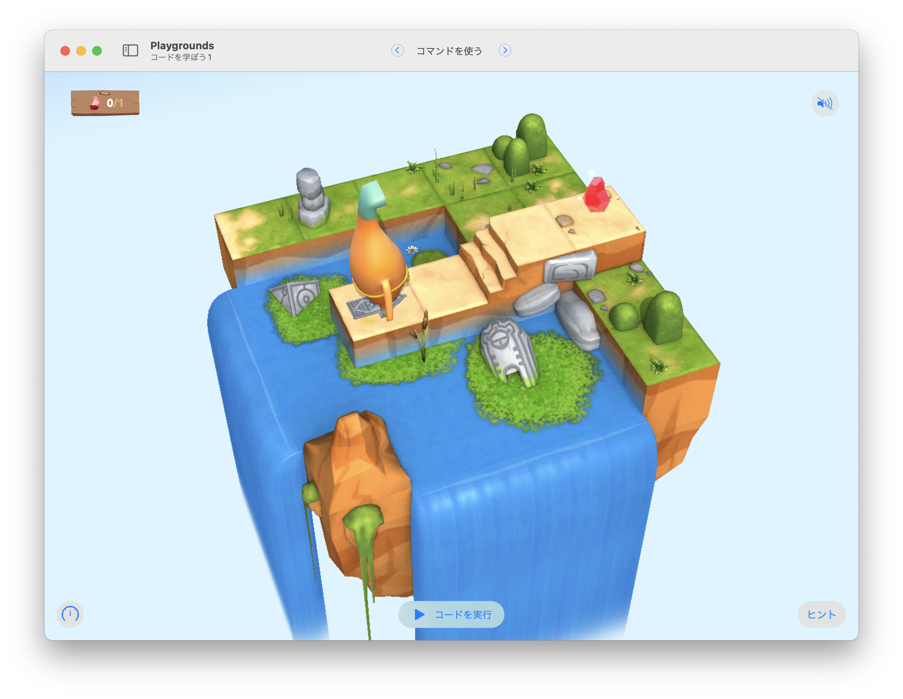

# コマンドを使う

このステージの目標は...
ステージにあるジェム（宝石）を集める




## 考え方と手順

英語になれる
まずは、アプリの基本的な操作方法を習得しましょう。

実行スピードの選択
「一番早く実行」は使わない
「ステップ実行」を活用する

間違いを見つけ出せるようになることに焦点を当てる
プログラムをやり直さない
コードを追加しない
コードを削除しない

### 疑似コード

```
```

## 解答例

```swift
```

### より上手な手法

```swift
```