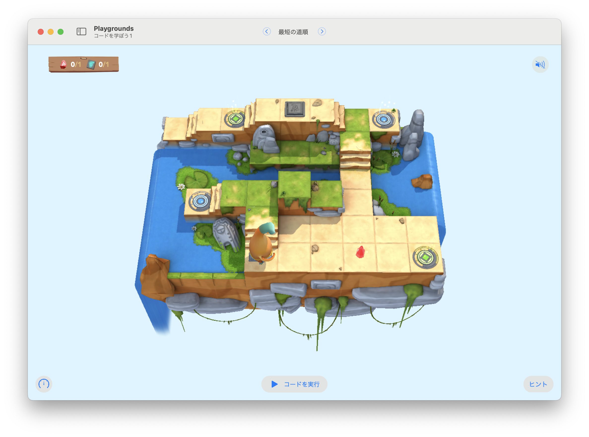

# 最短の道順

このステージの目標は...
最短のルートを見つけ出して、ジェムを集めてスイッチをオンにする。




## 考え方と手順

ステージをよく観察して、2組のワープを発見する

### 疑似コード

```
```

## 解答例

```swift
moveForward()
moveForward()
moveForward()
collectGem()
moveForward()
moveForward()
moveForward()
moveForward()
toggleSwitch()
```
