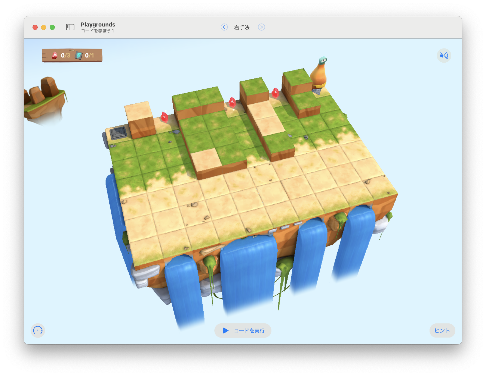

# 右手法

このステージの目標は...
右手方のアルゴリズムで進みつつ、ジェムを集めてスイッチをオンにする。




## 考え方と手順


### 疑似コード

```
```

## 解答例


```swift
func navigateAroundWall() {
    if isBlockedRight {
        moveForward()
    }  else {
        turnRight()
        moveForward()
    }
}

while !isOnClosedSwitch {
    navigateAroundWall()
    if isOnGem {
        collectGem()
        turnRight()
    }
}
toggleSwitch()
```