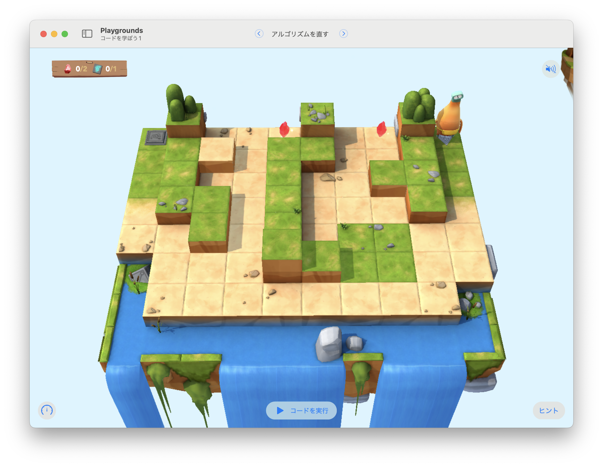

# アルゴリズムを直す

このステージの目標は...
すべてのジェムを集めてスイッチをオンにするために、アルゴリズムを正しく修正する。




`isBlockedLeft`が使えない

## 考え方と手順

厳しい条件から評価する

### 疑似コード

```
```

## 解答例

```swift
func navigateAroundWall() {
    if isBlocked && isBlockedRight {
        turnLeft()
    } else if isBlockedRight {
        moveForward()
    }  else {
        turnRight()
        moveForward()
    }
}
    
while !isOnClosedSwitch {
    navigateAroundWall()
    if isOnGem {
        collectGem()
        turnLeft()
        turnLeft()
    }
}
toggleSwitch()
```

### より上手な手法

```swift
func navigateAroundWall() {
    if !isBlocked {
        moveForward()
    }
    if isBlocked && isBlockedRight {
        turnLeft()
    } else if !isBlockedRight {
        turnRight()
    }
}
    
while !isOnClosedSwitch {
    navigateAroundWall()
    if isOnGem {
        collectGem()
    }
}
toggleSwitch()
```