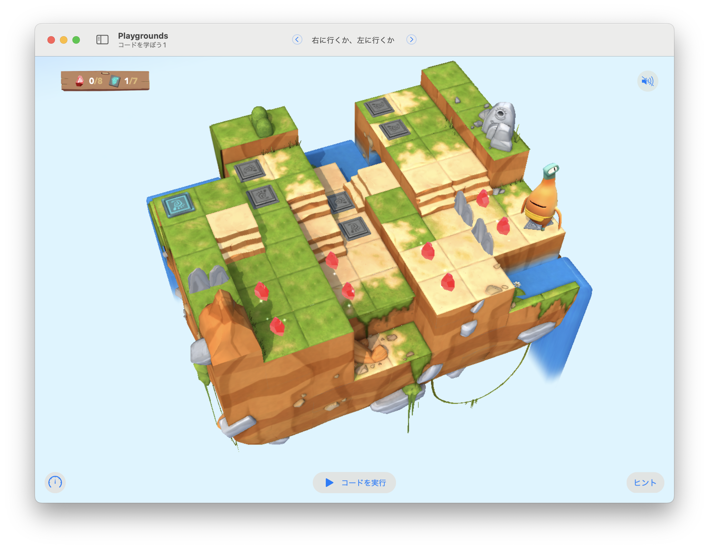

# 右に行くか、左に行くか

このステージの目標は...
すべてのジェムを集めてスイッチをオンにするために、自分でアルゴリズムを構築する



いろんなアプローチがある
最終ゴールをどこに設定するか
左を向くのはどんな場合か
右を向くのはどんな場合か
条件は何を先に評価すべきか


## 考え方と手順

### 疑似コード

```
```

## 解答例

```swift
func collectGemOrToggleSwitch() {
    if isOnGem {
        collectGem()
    } else if isOnClosedSwitch {
        toggleSwitch()
    }
}

while !isBlocked {
    moveForward()
    collectGemOrToggleSwitch()
    if isBlocked {
        if isOnClosedSwitch || !isBlockedLeft {
            turnLeft()
        } else if isOnGem || !isBlockedRight {
            turnRight()
        } 
    }
}
```

### より上手な手法

```swift
```