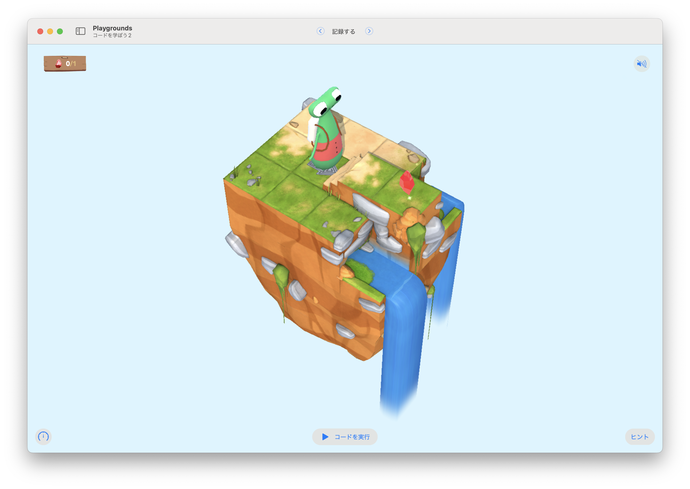

# 記録する

このステージの目標は...
集めた宝石を数えるために、変数を宣言する




## 考え方と手順

### 疑似コード

```
```

## 解答例

```swift
var gemCounter = 0

moveForward()
moveForward()
collectGem()
gemCounter = 1
```

### より高度な手法

```swift
```