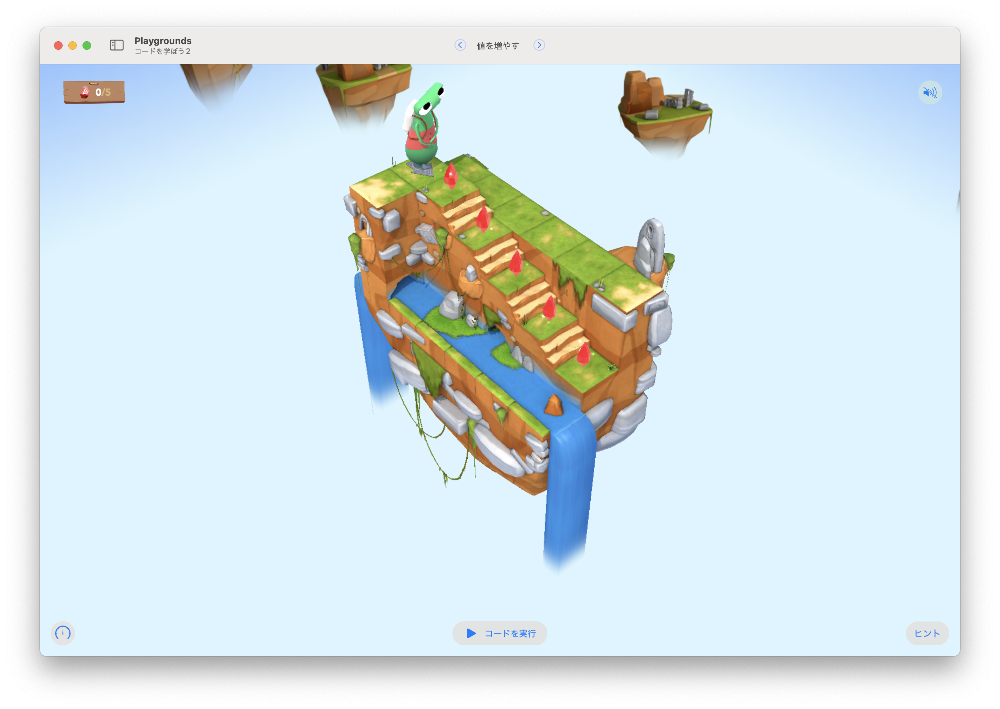

# 値を増やす1

このステージの目標は...
ジェムを集めるたびに、`gemCounter`変数の値を更新する




## 考え方と手順

### 疑似コード

```
```

## 解答例

```swift
var gemCounter = 0

moveForward() 
collectGem()
gemCounter = 1

moveForward() 
collectGem()
gemCounter = 2

moveForward() 
collectGem()
gemCounter = 3

moveForward() 
collectGem()
gemCounter = 4

moveForward() 
collectGem()
gemCounter = 5
```

### より高度な手法

```swift
```