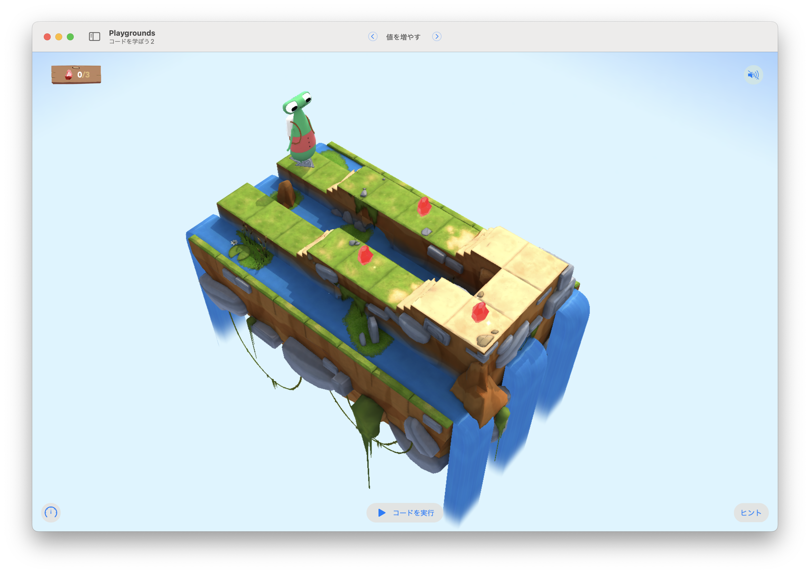

# 値を増やす2

このステージの目標は...
ジェムを集めるたびに、変数の値を1ずつ加算する



ジェムの出現パターンはランダム
インクリメントのコード


## 考え方と手順

### 疑似コード

```
```

## 解答例

```swift
```

### より高度な手法

```swift
var gemCounter = 0

func navigation() {
    moveForward()
    if !isBlockedRight {
        turnRight()
    }
}

while !isBlocked {
    navigation()
    if isOnGem {
        collectGem()
        gemCounter = gemCounter + 1
    }
}
```