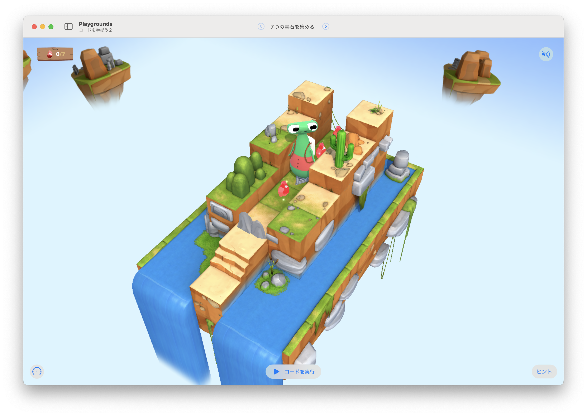

# 7つの宝石を集める

このステージの目標は...
ジェムをぴったり7個だけ集める




## 考え方と手順

### 疑似コード

```
```

## 解答例

```swift
var gemCounter = 0

func turnAround() {
    turnLeft()
    turnLeft()
}

while gemCounter < 7 {
    moveForward()
    if isOnGem {
        collectGem()
        gemCounter += 1
    }
    if isBlocked {
        turnAround()
    }    
}
```

### より高度な手法

```swift
```