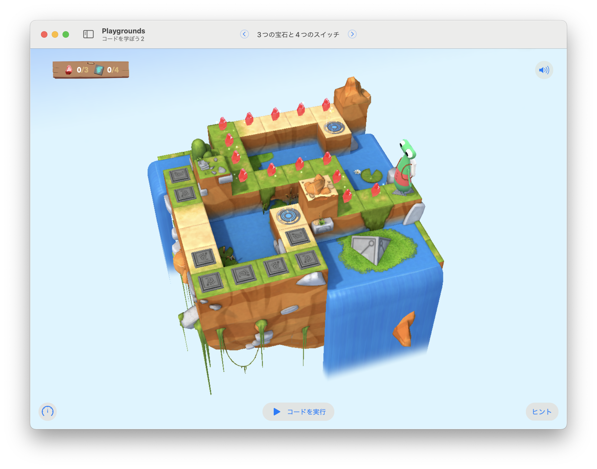

# 3つの宝石と4つのスイッチ

ジェムを3つだけ集めて、スイッチを4つだけ点灯する。



## 考え方と手順

まずは、「行き止まりまで歩き続ける」ことだけを考えよう。
「どんな時に右を向いて、どんな時に左を向くか」を調べる必要がある。
それができたら、宝石を3つだけ集める方法とスイッチを4つだけ点灯する方法を考える。

「宝石を3つだけ集める」ことは、「集めた宝石が3個より少なければ、集める」ということ。つまり、宝石を3個集めたら、それ以上は宝石があっても集めてはいけない。「そこに宝石があって、集めた宝石が3個未満なら、宝石を集める」というIfステートメントが構築できそうだ（宝石を数えるのを忘れずに）。
スイッチについても、同じように考えよう。

## 全体のコード

```swift
var gemCounter = 0
var switchCounter = 0

func navigation() {
    moveForward()
    if !isBlockedRight {
        turnRight()
    } else if !isBlockedLeft {
        turnLeft()
    } 
}

while !isBlocked {
    navigation()
    if isOnGem && gemCounter < 3{
        collectGem()
        gemCounter += 1
    } else if isOnClosedSwitch && switchCounter < 4 {
        toggleSwitch()
        switchCounter += 1
    }
}
```