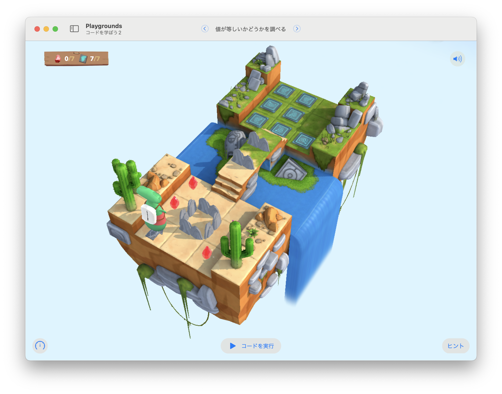

# 値が等しいかどうか調べる

ランダムに出現するスイッチと同じ数だけ、宝石を集める。



## 考え方と手順

ここでも「集めたジェムの数」を数える必要がある。
`gemCounter`変数を宣言しておこう。

「ランダムに出現するスイッチの数」は`randomOfSwitchs`で取得できる。
あらかじめ、`switchCounter`定数に設定されているので、これを利用した`while`ループを構築しよう。
「集めたジェムの数」が「スイッチの数」よりも少ない間、ループを繰り返せばいい。

「ジェムがあったら、集めて数える」ための関数を定義しておくと、コードをシンプルに記述できるだろう。

## 全体のコード

```swift
let switchCounter = numberOfSwitches
var gemCounter = 0

func collectAndCountGem() {
    if isOnGem {
        collectGem()
        gemCounter += 1        
    }    
}

while gemCounter < switchCounter {
    moveForward()
    collectAndCountGem()    
    if isBlocked {
        turnRight()        
    }
}
```