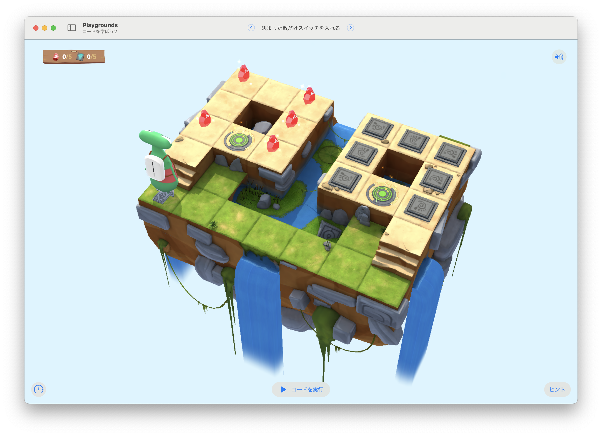

# 決まった数だけスイッチを入れる

このステージの目標は...
集めたジェムと同じ数だけ、スイッチをオンにする



ジェムとスイッチの数はランダム


## 考え方と手順

### 疑似コード

```
```

## 解答例

```swift
var gemCounter = 0
var switchCounter = 0

func navigation() {
    moveForward()
    if isBlocked {
        turnRight()
    }
}

for i in 1 ... 9 {
    navigation()
    if isOnGem {
        collectGem()
        gemCounter += 1
    }
    
}

while switchCounter < gemCounter {
    navigation()        
    if isOnClosedSwitch {
        toggleSwitch()
        switchCounter += 1
    }
}
```

### より上手な手法

```swift
var gemCounter = 0
var switchCounter = 0

func navigation() {
    moveForward()
    if isBlocked {
        turnRight()
    }
}

while (switchCounter == 0) || (switchCounter < gemCounter) {
    navigation()
    if isOnGem {
        collectGem()
        gemCounter += 1
    } else if isOnClosedSwitch {
        toggleSwitch()
        switchCounter += 1
    }
}
```