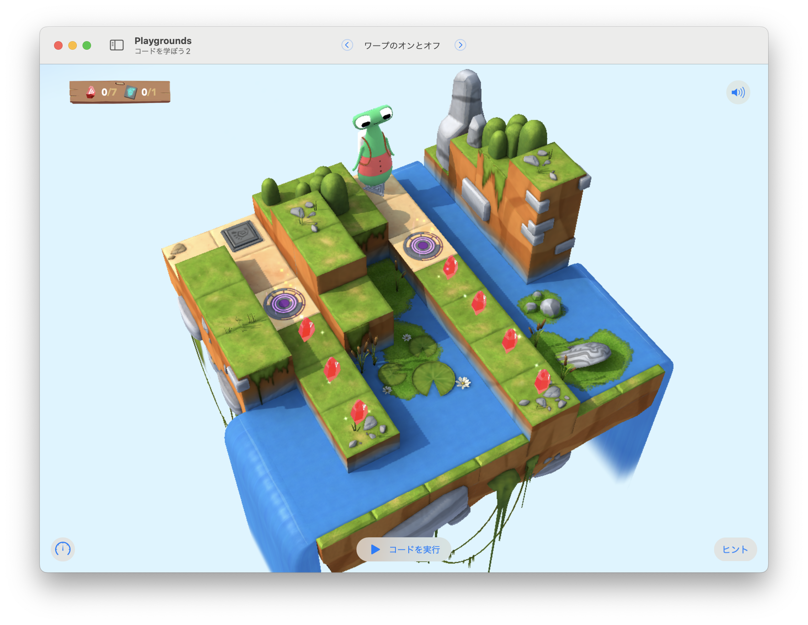

# ワープのオンとオフ

ワープのオンとオフを切り替えて、宝石を集めてスイッチを点灯させる。



## 考え方と手順

どのタイミングで「ポータルのオンとオフを切り替えるか」が重要になる。
順次実行的に、コマンドをひとつずつ実行する方法もあるが、ここではアルゴリズムを構築して、より高度な手段を考える。

「ポータルがオンならオフにする、そうでなければオンにする」というIfステートメントがあると良さそうだ。
そして、キャラクターが行き止まりにまで進んだら、ポータルを切り舞える。

このステージの宝石は7個で固定されているので、「宝石を7個集めるまで繰り返す`while`ループ」を構築しよう。

## 全体のコード

```swift
var gemCoutner = 0

func turnAround() {
    turnLeft()
    turnLeft()    
}

func collectGemOrToogleSwitch() {
    if isOnGem {
        collectGem()
        gemCoutner += 1
    } else if isOnClosedSwitch {
        toggleSwitch()            
    }
}

func togglePortal() {
    if purplePortal.isActive {
        purplePortal.isActive = false    
    } else {
        purplePortal.isActive = true
    } 
}

while gemCoutner < 7 {
    moveForward()
    collectGemOrToogleSwitch()
    if isBlocked {
        turnAround()
        togglePortal()        
    }
}
```