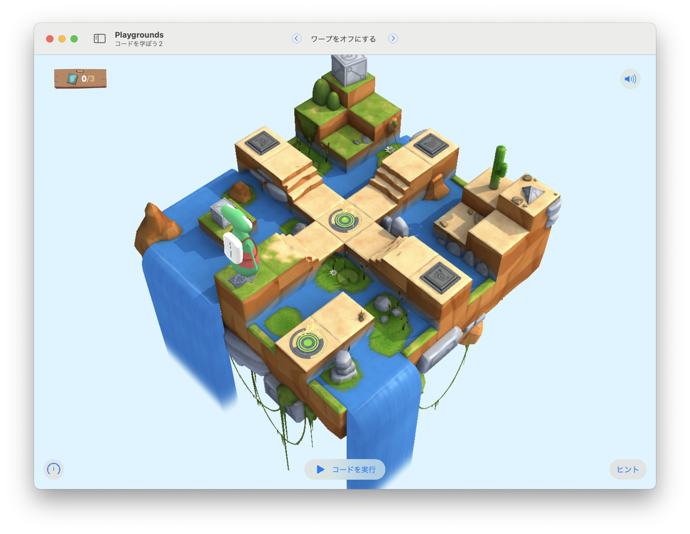

# ワープをオフにする

緑のワープをオフにして、3つのスイッチを点灯する。



## 考え方と手順

点灯したスイッチの数を追跡するために、`switchCounter`変数を宣言しておこう。`while`ループの条件に使えそうだ。
それから、スイッチを点灯した後は必ず後ろを向く必要があるので、`turnAround()`関数を定義しておくと役に立つかもしれない。

緑のポータルは、`greenPortal`の`.isActive`に`false`を設定することで無効化できる。最初に無効化しておこう。

また、スイッチは必ず、道の行き止まりにあることに注目しよう。
行き止まりのときに、後ろを向きつつ、スイッチを点灯することができそうだ。
後は、点灯したスイッチが3個になるまで繰り返す`while`ループを構築できれば、難しくはないだろう。

## 全体のコード

```swift
var switchCounter = 0

func turnAround() {
    turnRight()
    turnRight()    
}

func toggleAndCountSwitch() {
    toggleSwitch()
    switchCounter += 1
}

greenPortal.isActive = false
while switchCounter < 3 {
    moveForward()    
    if !isBlockedRight {
        turnRight()
    } else if isBlocked {
        turnAround()     
        toggleAndCountSwitch()        
    }   
}
```