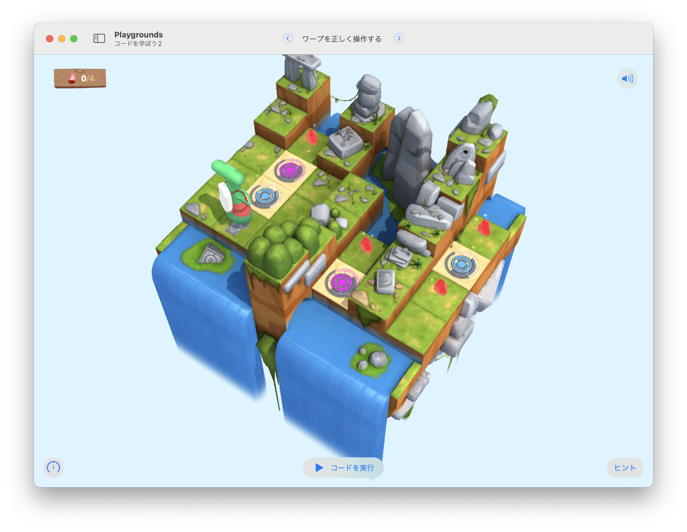

# ワープを正しく操作する

2組あるワープのオンとオフを切り替えて、4つの宝石を集める。



## 考え方と手順

2つのポータル（青とピンク）をうまく切り替えながら進まないといけないので、ややこしいと感じてしまうかもしれない。
だが、このステージのジェムは場所と数が固定されている。
まずは、余計なことは考えずに「ジェムを4つ集めるまで、まっすぐ歩き続ける」ことを考えよう。

キャラクターが真っ直ぐ歩き続けると、すぐに青のポータルで無限ループに陥ってしまう。
青のポータルで一回ワープした後にジェムをひとつ取ったら、青のループは無効にしておきたい。
これは、キャラクターが行き止まりにいるタイミングだ。
つまり、「行き止まりなら、青のポータルをオンからオフに切り替える」というIfステートメントがいいだろう。
そうすれば、「同じ道にある2つ目のジェム」を回収しに行ける。
そのまま直進すると行き止まりになるので、今度は「青のポータルをオフからオンに切り替える」ことになる。

さて、「ポータルがオンならオフに、オフならオンに切り替える関数」があると便利そうだ。
`togglePortal()`関数を定義しておこう。

無事、元の道に戻ってくるが、今度はピンクのポータルでワープした後、無限ループに陥ってしまう。
この問題を解決するには「青のポータルがオンの時にピンクはオフで、青のポータルがオフの時にピンクはオン」にできればいい。
`togglePortal()`関数では青のポータルだけでなく、ピンクのポータルも切り替えられるだろう。
そして、キャラクターが動き始める前に、あらかじめピンクのポータルだけオフに設定しておけば問題は解決だ。

### 擬似コード

```
ピンクのポータルを無効にする
ジェムを4個集めるまで、以下を繰り返す
    前に進む
    ジェムがあったら、集めて数える
    行き止まりだったら、後ろを向いてポータルを切り替える
```

## 全体のコード

```swift
var gemCounter = 0
pinkPortal.isActive = false

func turnAround() {
    turnLeft()
    turnLeft()    
}

func collectAndCountGem() {
    collectGem()
    gemCounter += 1
}

func togglePortals() {
    if bluePortal.isActive {
        bluePortal.isActive = false
        pinkPortal.isActive = true
    } else {
        bluePortal.isActive = true
        pinkPortal.isActive = false
    }
}

while gemCounter < 4 {
    moveForward()
    if isOnGem { 
        collectAndCountGem() 
    }
    if isBlocked {
        turnAround()
        togglePortals()        
    }
}
```